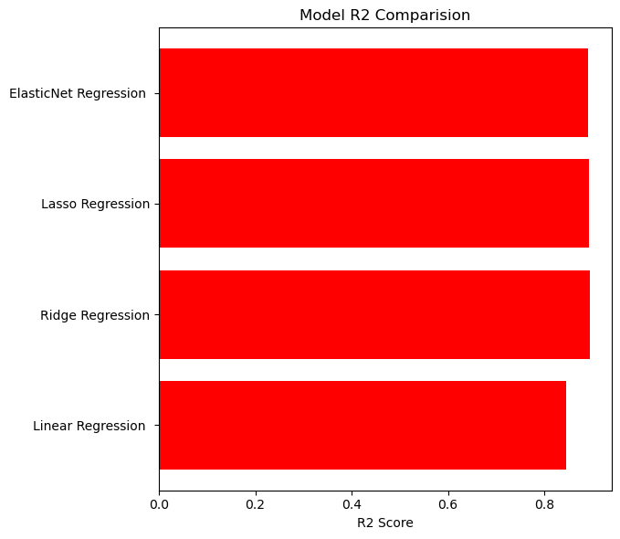
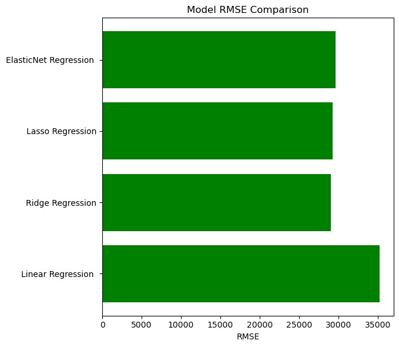

# Ames Housing – Regression Model Comparison

This project compares Linear Regression, Ridge, Lasso, and ElasticNet models
on the Ames Housing dataset to analyze the impact of regularization on
high-dimensional and multicollinear data.

## Dataset
- Ames Housing Dataset
- Target variable: SalePrice
- Contains numerical and categorical features
- High dimensionality after one-hot encoding

- ## Methodology
- Missing value handling:
  - Categorical variables filled with "None"
  - Structural numerical missing values filled with 0
  - Remaining numerical missing values filled with median
- One-hot encoding applied to categorical variables
- StandardScaler applied only to numerical features
- Train-test split
- Hyperparameter tuning using GridSearchCV

- ## Models Compared
- Linear Regression
- Ridge Regression (L2 Regularization)
- Lasso Regression (L1 Regularization)
- ElasticNet Regression (L1 + L2)

- ## Evaluation Metrics
- R² Score
- Mean Squared Error (MSE)
- Root Mean Squared Error (RMSE)

## Results
- Ridge Regression achieved the highest R² score
- Ridge Regression produced the lowest RMSE
- Linear Regression performed worst due to lack of regularization

- 

