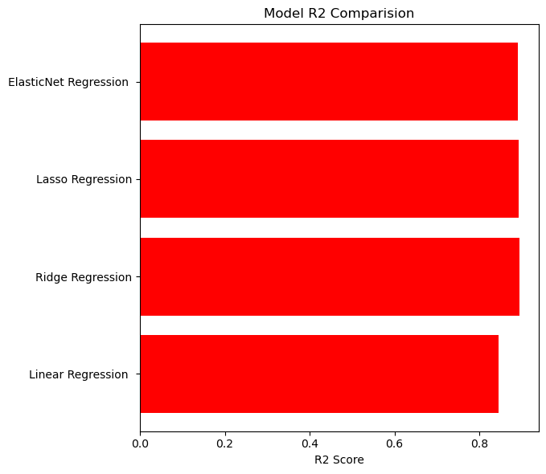
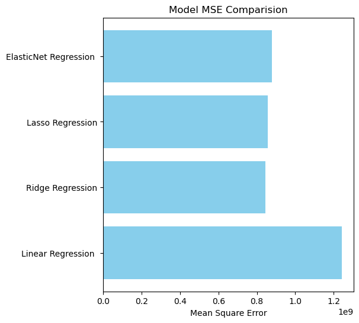
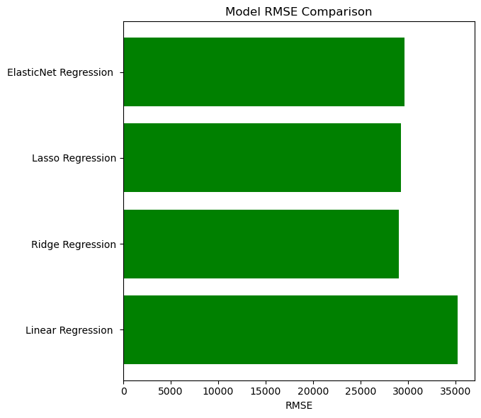

<div align="center">

# 🏠 Ames Housing – Regression Model Comparison

**Linear, Ridge, Lasso & ElasticNet Karşılaştırması**

[](https://python.org)
[](https://scikit-learn.org)
[](https://pandas.pydata.org)
[](https://numpy.org)
[](https://matplotlib.org)
[](https://jupyter.org)
[](https://opensource.org/licenses/MIT)

**🏆 Ridge Regression — En Yüksek R², En Düşük RMSE**

</div>

---

## 📌 Proje Hakkında

Bu proje, **Ames Housing** veri seti üzerinde **Linear Regression, Ridge, Lasso ve ElasticNet** modellerini karşılaştırarak regularizasyon tekniklerinin yüksek boyutlu ve çoklu doğrusal bağlantılı (multicollinear) verilerdeki etkisini analiz etmektedir.

---

## 📊 Veri Seti

| Özellik | Değer |
|---------|-------|
| **Kaynak** | Ames Housing Dataset (Kaggle) |
| **Hedef Değişken** | `SalePrice` (Ev Fiyatı) |
| **Özellikler** | Sayısal + Kategorik (one-hot sonrası yüksek boyut) |
| **Not** | Veri seti boyut nedeniyle repo'ya dahil edilmemiştir. Kaggle'dan indirilebilir. |

---

## 🔧 Metodoloji

```
Ham Veri → Eksik Veri İşleme → One-Hot Encoding → StandardScaler → GridSearchCV → Model Karşılaştırması → Değerlendirme
```

### 1️⃣ Veri Ön İşleme

| Adım | Yöntem | Açıklama |
|------|--------|----------|
| **Eksik Değer (Kategorik)** | `"None"` ile doldurma | Eksik kategorik değişkenler |
| **Eksik Değer (Yapısal)** | `0` ile doldurma | Garaj/bodrum gibi yapısal boşluklar |
| **Eksik Değer (Sayısal)** | Medyan ile doldurma | Kalan sayısal eksiklikler |
| **Encoding** | `get_dummies` (One-Hot) | Tüm kategorik değişkenler |
| **Ölçeklendirme** | StandardScaler | Yalnızca sayısal değişkenler (dummy değişkenler ölçeklenmedi) |
| **Split** | Train/Test Split | Model öncesi ayrıştırma |

### 2️⃣ Modeller ve Hiperparametre Optimizasyonu

| Model | Regularizasyon | GridSearchCV |
|-------|---------------|--------------|
| **Linear Regression** | ❌ Yok | — |
| **Ridge** | ✅ L2 | `alpha` parametre taraması |
| **Lasso** | ✅ L1 | `alpha` parametre taraması |
| **ElasticNet** | ✅ L1 + L2 | `alpha`, `l1_ratio` parametre taraması |

Tüm modeller **GridSearchCV + Cross-Validation** ile optimize edilmiştir.

---

## 📈 Sonuçlar

| Model | R² Score | MSE | RMSE |
|-------|----------|-----|------|
| ❌ Linear Regression | En düşük | En yüksek | En yüksek |
| ✅ **Ridge** | **En yüksek** | **En düşük** | **En düşük** |
| 🔶 Lasso | Rekabetçi | Rekabetçi | Rekabetçi |
| 🔷 ElasticNet | Rekabetçi | Rekabetçi | Rekabetçi |

**Ridge Regression**, L2 regularizasyonu sayesinde çoklu doğrusal bağlantıyı etkili şekilde yönetmiş ve en başarılı genelleme performansını göstermiştir.

### Görseller





---

## 💡 Ana Çıkarımlar

- ✅ Regularizasyon, regresyon performansını önemli ölçüde iyileştirir
- ✅ Ridge, multicollinear ortamlarda özellikle etkilidir
- ✅ Lasso ve ElasticNet için feature scaling kritiktir
- ✅ Eksik veri ve kategorik değişken yönetimi doğru yapılmalıdır

---

## ⚙️ Kullanım

```bash
# 1. Depoyu klonla
git clone https://github.com/ferhattkoc-ml/ames-housing-regression-comparison.git
cd ames-housing-regression-comparison

# 2. Sanal ortam oluştur (opsiyonel)
python -m venv venv
source venv/bin/activate  # Linux/macOS
venv\Scripts\activate     # Windows

# 3. Bağımlılıkları yükle
pip install -r requirements.txt

# 4. Notebook'u aç
jupyter notebook
```

> **Not:** `AmesHousing.csv` dosyasını [Kaggle](https://www.kaggle.com/competitions/house-prices-advanced-regression-techniques) üzerinden indirip proje kök dizinine koyun.

---

## 🛠️ Tech Stack

| Kategori | Teknolojiler |
|----------|-------------|
| **Dil** | Python 3.8+ |
| **Veri İşleme** | Pandas, NumPy |
| **Makine Öğrenmesi** | scikit-learn (LinearRegression, Ridge, Lasso, ElasticNet, GridSearchCV, StandardScaler) |
| **Görselleştirme** | Matplotlib |
| **Ortam** | Jupyter Notebook |

---

## 📂 Proje Yapısı

```
ames-housing-regression-comparison/
├── ames-housing-regression-comparison.ipynb   # Ana notebook
├── AmesHousing.csv                            # Veri seti (Kaggle)
├── r2_score.png                               # R² karşılaştırma görseli
├── mse.png                                    # MSE karşılaştırma görseli
├── rmse.png                                   # RMSE karşılaştırma görseli
├── requirements.txt                           # Bağımlılıklar
└── README.md                                  # Bu dosya
```

---

## 👤 Yazar

**Ferhat Koç** · [GitHub](https://github.com/ferhattkoc-ml) · [LinkedIn](https://linkedin.com/in/ferhattkocc/)

> ⭐ Bu projeyi beğendiyseniz bir yıldız bırakmayı unutmayın!

---

<div align="center">
  <sub>Built with ❤️ by Ferhat Koç</sub>
</div>
